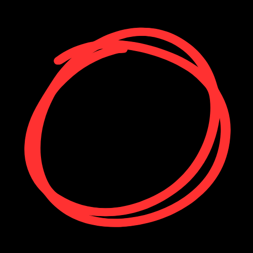
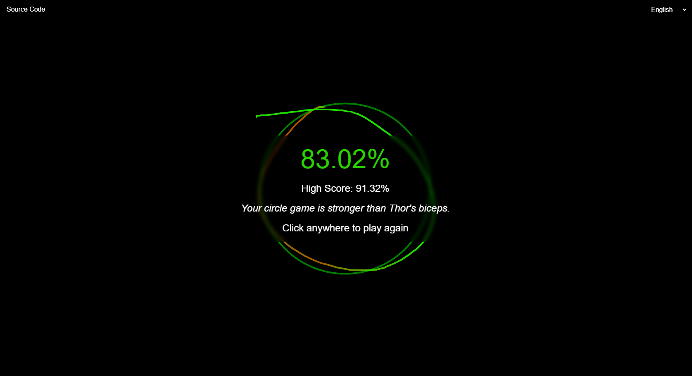
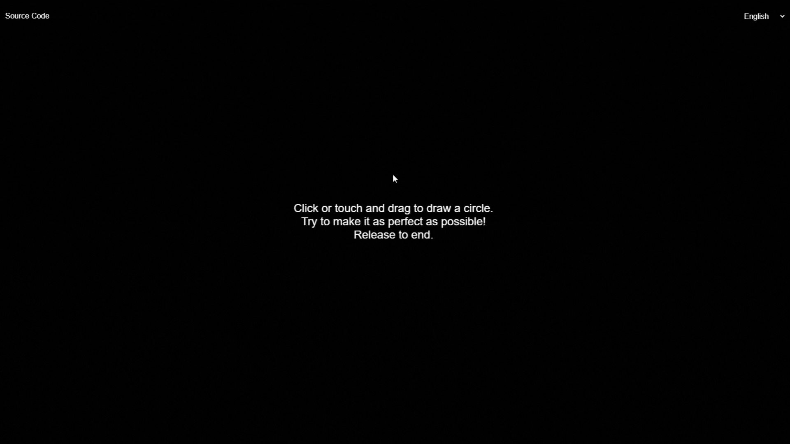

# 🎨 Perfect Circle Game

<div align="center">
  
  
  [](https://github.com/MohdYahyaMahmodi/perfect-circle/blob/main/LICENSE)
  [](https://github.com/MohdYahyaMahmodi/perfect-circle/stargazers)
  [](https://github.com/MohdYahyaMahmodi/perfect-circle/network)
  [](https://github.com/MohdYahyaMahmodi/perfect-circle/issues)
</div>

## 📖 Table of Contents

- [About the Project](#-about-the-project)
- [Features](#-features)
- [Demo](#-demo)
- [Getting Started](#-getting-started)
- [How to Play](#-how-to-play)
- [Multilingual Support](#-multilingual-support)
- [Technologies Used](#-technologies-used)
- [Contributing](#-contributing)
- [License](#-license)
- [Contact](#-contact)

## 🎯 About the Project

Perfect Circle is an engaging web-based game that challenges players to draw the most perfect circle possible. With real-time feedback, score tracking, and multilingual support, it offers a fun and addictive experience for users of all ages.

<div align="center">
  
</div>

## ✨ Features

- 🖌️ Intuitive drawing interface
- 📊 Real-time perfection score calculation
- 🌈 Color-coded feedback
- 🏆 High score tracking
- 🌍 Support for multiple languages (English, Spanish, French, German, Japanese)
- 📱 Responsive design for both desktop and mobile devices
- 🎭 Humorous feedback messages

## 🎮 Demo

Check out the live demo of the Perfect Circle game [here](https://mohdyahyamahmodi.github.io/perfect-circle/).

## 🚀 Getting Started

To get a local copy up and running, follow these simple steps:

1. Clone the repository
   ```sh
   git clone https://github.com/MohdYahyaMahmodi/perfect-circle.git
   ```
2. Navigate to the project directory
   ```sh
   cd perfect-circle
   ```
3. Open `index.html` in your preferred web browser

## 🕹️ How to Play

1. Click and drag (or touch and drag on mobile devices) to start drawing your circle
2. Try to make the circle as perfect as possible
3. Release to end your drawing and see your score
4. Enjoy the humorous feedback based on your performance
5. Try again to beat your high score!

<div align="center">
  
</div>

## 🌐 Multilingual Support

Perfect Circle supports multiple languages to cater to a global audience. Currently supported languages are:

- 🇺🇸 English
- 🇪🇸 Spanish (Español)
- 🇫🇷 French (Français)
- 🇩🇪 German (Deutsch)
- 🇯🇵 Japanese (日本語)

To change the language, use the dropdown menu in the top-right corner of the game interface.

## 💻 Technologies Used

- HTML5 Canvas for drawing functionality
- Vanilla JavaScript for game logic
- CSS3 for styling and responsive design

## 🤝 Contributing

Contributions are what make the open-source community such an amazing place to learn, inspire, and create. Any contributions you make are **greatly appreciated**.

1. Fork the Project
2. Create your Feature Branch (`git checkout -b feature/AmazingFeature`)
3. Commit your Changes (`git commit -m 'Add some AmazingFeature'`)
4. Push to the Branch (`git push origin feature/AmazingFeature`)
5. Open a Pull Request

## 📄 License

Distributed under the MIT License. See `LICENSE` for more information.

## 🔗 Contact

Mohd Yahya Mahmodi
- Twitter: [@MohdMahmodi](https://twitter.com/MohdMahmodi)
- Email: contact@mohdmahmodi.com
- Website: [mohdmahmodi.com](https://mohdmahmodi.com)

Project Link: [https://github.com/MohdYahyaMahmodi/perfect-circle](https://github.com/MohdYahyaMahmodi/perfect-circle)

---

<div align="center">
  Made with ❤️ by Mohd Yahya Mahmodi
</div>